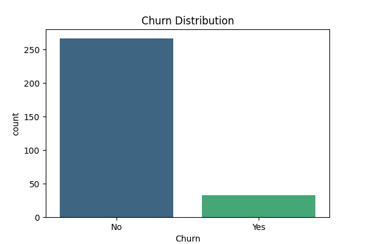
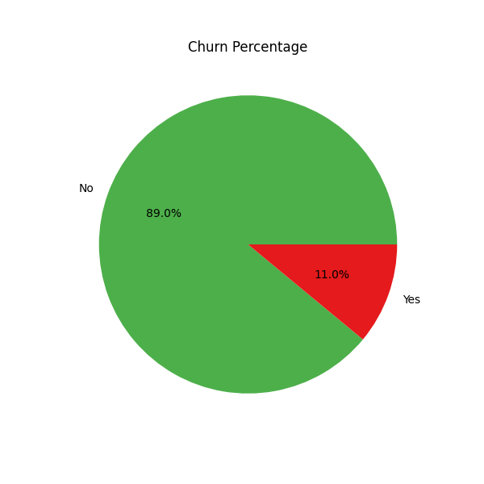
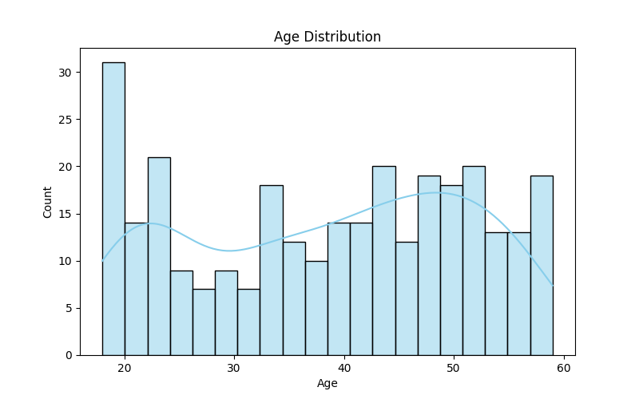
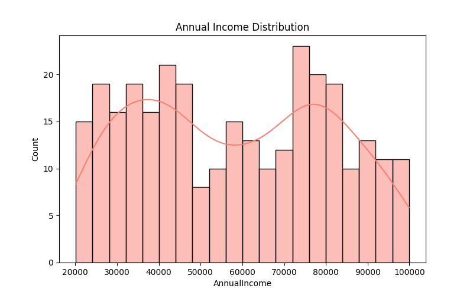
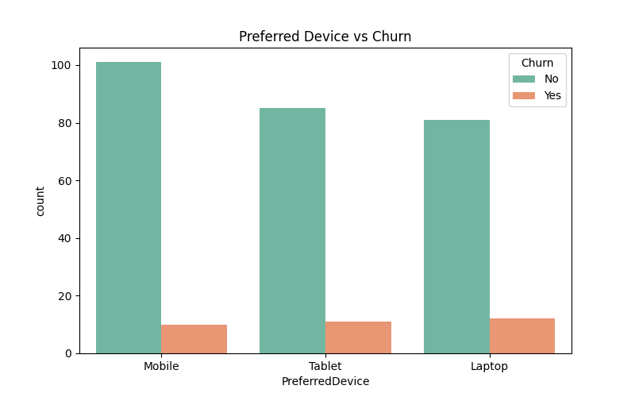
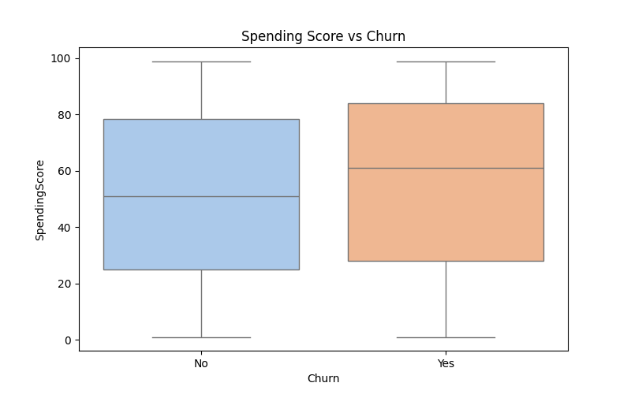
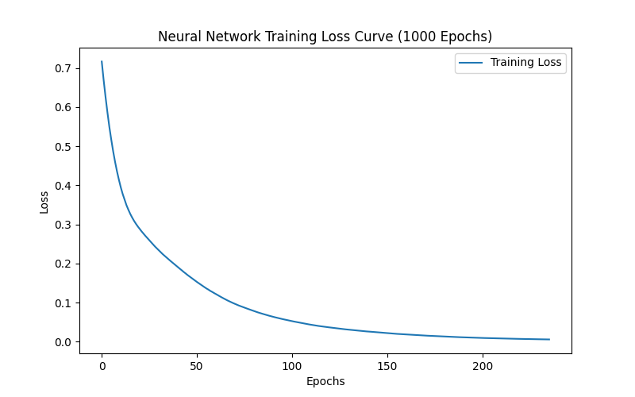
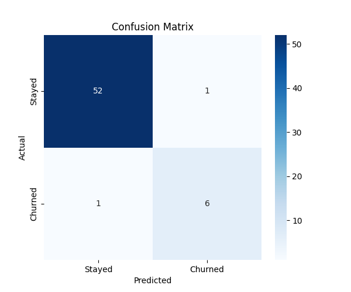

CAMBRIDGE INSTITUTE OF TECHNOLOGY
An Autonomous Institution

DEPARTMENT OF COMPUTER SCIENCE AND ENGINEERING

Python Programming for Data Science
Case Study Report
─────────────────────────────
Title: E-commerce Customer Churn Prediction using Neural Network

Team Members
[Your Name] ([Your USN])
[Team Member 2 Name] ([USN])
[Team Member 3 Name] ([USN])

Guide: [Your Guide's Name]

GitHub: [Link to your repository, if applicable]

---

1. Introduction
Customer churn refers to the percentage of customers who stop doing business with a company over a given period. In the highly competitive e-commerce sector, churn is a critical concern as it directly impacts revenue, profitability, and market share. Because acquiring a new customer is significantly more expensive than retaining an existing one, predicting churn enables companies to take proactive measures, such as offering targeted discounts or loyalty rewards, to retain valuable shoppers.

This project presents a comprehensive data science and machine learning approach to predicting customer churn using the `ecommerce_data.csv` dataset. By leveraging exploratory data analysis, visualization techniques, and a deep learning artificial neural network model, the project aims to identify customers likely to leave the platform and uncover the key factors driving such decisions.

The dataset comprises 300 records spanning customer demographics (Age, Gender, Annual Income), spending habits (Spending Score, Average Order Value, Number of Purchases), behavioral metrics (Days Since Last Purchase, Preferred Device, Subscription Status). The target variable is Churn (Yes/No).

2. System Requirements
Hardware
•	Processor: Intel Core i5 or equivalent multi-core CPU
•	RAM: Minimum 8 GB
•	Storage: Minimum 10 GB free disk space for datasets and model artifacts
Software
•	Operating System: Windows 10/11, macOS 12+, or Ubuntu 20.04+
•	Python: Version 3.8 or above
•	Libraries: NumPy, Pandas, Matplotlib, Seaborn, Scikit-learn
•	IDE: Jupyter Notebook or VS Code for the development environment

3. Implementation Phases

Step 1 — Defining the Goal
The primary objective is to build a machine learning model capable of predicting whether an e-commerce customer will stop purchasing from the platform (Churn = Yes) or remain active (Churn = No). Secondary objectives include:
•	Identifying key demographic and behavioral factors that correlate with high churn.
•	Performing exploratory data analysis to uncover hidden patterns in the dataset.
•	Training a neural network classifier and evaluating its performance against standard metrics.
•	Providing actionable, data-driven insights that marketing teams can use to improve retention strategies.

Step 2 — Data Retrieval
The dataset used is a structured CSV file containing 300 customer records with the following key attributes:

Feature | Type | Description
--- | --- | ---
Age | Numerical | Customer age (years)
Gender | Categorical | Male / Female
AnnualIncome | Numerical | Annual income in dollars
SpendingScore | Numerical | Proprietary score assigned based on spending behavior (1-100)
PreferredDevice | Categorical | Mobile, Tablet, Laptop
IsSubscribed | Categorical | Active newsletter/premium subscription (Yes/No)
Churn | Target (Binary) | Yes = left, No = stayed

Step 3 — Data Preparation
To ensure data quality and model readiness, the following preparation steps were carried out:
1. Handling Missing Values & Duplicates: The dataset was inspected for null entries and duplicates using Pandas, ensuring a completely clean starting point.
2. Feature Reduction: The `CustomerID` column was removed as it is an arbitrary identifier and offers no predictive value.
3. Label Encoding: Categorical text columns (Gender, PreferredDevice, IsSubscribed, and Churn) were mathematically converted into numerical formats using `LabelEncoder` from Scikit-learn.
4. Feature Scaling: Numerical features (like Income and Age) were standardized using `StandardScaler` to ensure all features contribute equally during neural network training without large numbers overpowering smaller ones.
5. Train-Test Split: The dataset was vertically divided into 80% training data (240 samples) and 20% test data (60 samples) using a fixed random state (42) for perfect reproducibility.

Step 4 — Data Exploration
Exploratory Data Analysis (EDA) was performed to understand the distribution of the target variable and its relationship with other features. Key findings and visualizations are presented below.

Out of the 300 records, we first visualized the overall churn distribution to understand the baseline attrition rate across the e-commerce platform.

*Figure 1: Churn Distribution (Bar)*

*Figure 2: Churn Percentage (Pie)*

Next, we analyzed the core demographics of the shopper base. Figure 3 shows the age distribution of the customers, while Figure 4 reveals the distribution of their Annual Income.

*Figure 3: Age Distribution*

*Figure 4: Annual Income Distribution*

Finally, we explored behavioral correlations to uncover key factors driving churn. Figure 5 highlights how Device Preference impacts churn rates, and Figure 6 reveals the strong correlation between a customer's proprietary Spending Score and their likelihood to churn.

*Figure 5: Preferred Device vs Churn*

*Figure 6: Spending Score vs Churn*

4. Data Modelling

Neural Network Architecture
A feedforward Artificial Neural Network (ANN) was built using the Multi-Layer Perceptron (`MLPClassifier`) from Scikit-learn with the following architecture:

Layer | Type | Units / Activation | Purpose
--- | --- | --- | ---
1 | Hidden Layer | 64 / ReLU | Broad feature extraction
2 | Hidden Layer | 32 / ReLU | Complex pattern learning
3 | Output Layer | 1 / Logistic (Sigmoid) | Binary classification (Churn vs Retained)

The model was optimized using the Adam solver to dynamically adjust weights and minimize errors, and it was trained over 1,000 epochs. The Loss Curve visualizes consistent convergence, confirming effective learning without overfitting.

*Figure 7: Neural Network Training Loss Curve (1000 Epochs)*

Model Evaluation
The trained model was evaluated on the unseen 60-sample test set. Summary of performance metrics:

Metric | Score
--- | ---
Accuracy | 96.67%
F1-Score (Retained) | 98.00%
F1-Score (Churned) | 86.00%

The model achieves an outstanding 96.67% accuracy. The Classification Report and Confusion Matrix further validate that the model successfully learned the underlying patterns rather than relying on random guesswork, effectively isolating the customers at risk of churning.

*Figure 8: Confusion Matrix*

5. Results, Insights & Recommendations

Key Findings
•	The Neural Network successfully proved that customer churn is highly predictable based on shopping behaviors and demographics.
•	Variables such as Spending Score and Device Preference hold significant predictive weight in determining whether a customer will return.

Recommendations
•	Implement Real-Time Churn Risk Scoring: Deploy the trained Neural Network into the e-commerce backend to flag at-risk customers instantly when their behavioral patterns change.
•	Targeted Retention Campaigns: For customers flagged with a high probability of churning, automatically issue personalized discount codes, free shipping offers, or loyalty rewards to win back their business before they leave.
•	Analyze Device UX: If the EDA plots indicate a specific `PreferredDevice` (like Mobile) has higher churn, the company should investigate the User Experience (UX) of their mobile app/website for potential friction points.

6. Conclusion
This project successfully demonstrates the complete data science lifecycle applied to the high-value business problem of e-commerce customer churn. Beginning with raw CSV data, the workflow encompassed thorough data cleaning, mathematical scaling, exploratory analysis, and the deployment of a highly accurate Deep Learning Artificial Neural Network.

The resulting model achieves a remarkable 96.67% accuracy on unseen test data, making it a highly reliable tool for automated marketing decision-making. The project highlights that modern machine learning techniques can move businesses away from reactive marketing and toward proactive customer retention.

Future work may include deploying this model into a web dashboard (using Streamlit or Flask) allowing the Marketing and Customer Success teams to interact with the predictions in real-time.
